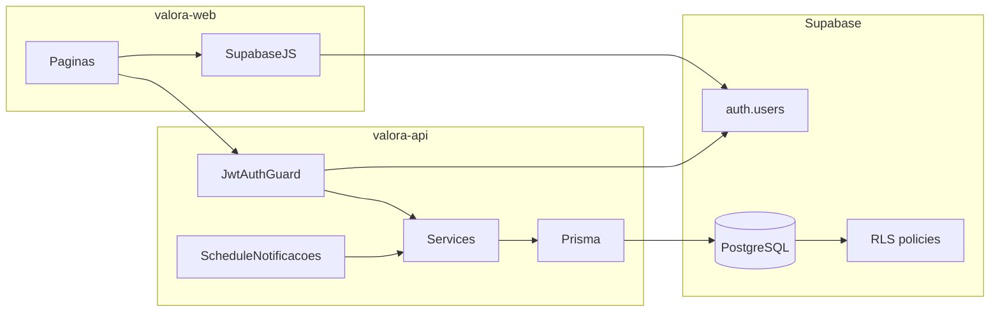

# Arquitetura do Valora

## Visão das camadas

## Frontend (`valora-web`)

- React 19, Vite, TypeScript, TanStack Query, Zustand, Tailwind.
- Rotas públicas: `/login`, `/register`, `/forgot-password`.
- Rotas autenticadas: `/` (dashboard), `/carteiras`, `/categorias`, `/transacoes`, `/investments` (extra, fora do DER).
- Variáveis permitidas: `VITE_API_URL`, `VITE_SUPABASE_URL`, `VITE_SUPABASE_ANON_KEY`.
- Nunca expor `SUPABASE_SERVICE_ROLE_KEY`, `DATABASE_URL` ou JWT secret no frontend.

## Backend (`valora-api`)

- NestJS, prefixo `/api`, Swagger em `/api/docs`.
- Auth: Passport JWT + JWKS do Supabase (`ES256`, audience `authenticated`).
- Guards globais: `JwtAuthGuard` (rotas `@Public()` para health) e throttle.
- Módulos de negócio desta etapa: usuários, carteiras, categorias, transações, dashboard, investments (extra), notificações (scheduler stub).
- Prisma é o ORM. Queries de dados privados sempre restringem pelo `sub` do JWT.

## Autenticação

1. Cadastro/login/recuperação de senha no cliente via Supabase Auth.
2. Trigger `handle_new_user` cria linha em `public.usuario` com o mesmo UUID.
3. O frontend envia `Authorization: Bearer <access_token>` à API.
4. A API não armazena senha. Ver decisão D-001 em [diagram-decisions.md](diagram-decisions.md).

## PostgreSQL e RLS

- Schema oficial em português (`usuario`, `carteira`, `transacao`, …).
- RLS habilitado nas tabelas privadas: o dono (`auth.uid()`) só acessa os próprios dados.
- `moeda` / `taxa`: leitura pública (BPMN); escrita `service_role`.
- `conteudo`: leitura autenticada; escrita `service_role` até existir papel admin.
- A API usa `DATABASE_URL` (role que pode bypassar RLS). RLS protege acesso direto (Supabase client / PostgREST).
- Open Finance (extra): `conexao_open_finance` e `evento_sync_open_finance` com RLS; detalhes em [docs/open-finance/belvo-integration.md](../open-finance/belvo-integration.md).

## Saldo e dashboard

- Fonte de verdade do saldo: `carteira.saldo_atual`, mantido por trigger em `transacao`.
- Contas Open Finance: após sync Belvo, `saldo_atual` é atualizado com o saldo da instituição.
- Dashboard agrega receitas/despesas do período e soma `saldo_atual` das carteiras ativas (inclui lançamentos com `origem = OPEN_FINANCE`).

## Processos

- Fluxo interativo: BPMN em `docs/diagrams/bpmn/valora-process.bpmn`.
- Processo paralelo: cron NestJS a cada 24h (`NotificacoesService`). Sem `data_vencimento` no modelo físico, o job não seleciona contas a vencer (D-010).

## Diagramas versionados

| Artefato | Caminho |
|---|---|
| Caso de uso | [docs/diagrams/use-case/valora-use-case.puml](../diagrams/use-case/valora-use-case.puml) |
| BPMN | [docs/diagrams/bpmn/valora-process.bpmn](../diagrams/bpmn/valora-process.bpmn) |
| DER | [docs/diagrams/er/valora-der.mmd](../diagrams/er/valora-der.mmd) |
| Modelo físico | [docs/diagrams/physical-model/valora-physical-model.mmd](../diagrams/physical-model/valora-physical-model.mmd) |

Como editar/renderizar: [docs/diagrams/README.md](../diagrams/README.md).

## Responsabilidades

| Camada | Faz | Não faz |
|---|---|---|
| Web | UI, Auth client, chamadas HTTP | Regras de saldo, RLS, secrets de serviço |
| API | Autorização JWT, validação, agregações, jobs | Guardar senha, bypass de isolamento por usuário |
| PostgreSQL | Integridade, triggers, RLS | UI, envio de e-mail |
| Supabase Auth | Identidade, senha, JWT | Dados financeiros |

## Migrations

Apply: `pnpm exec prisma migrate deploy` neste pacote. Cópia oficial do SQL em `supabase/migrations/`. Não aplicar os dois no mesmo banco (D-011).
