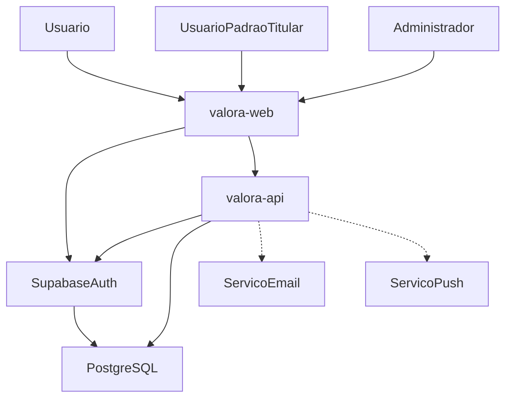

# Contexto do sistema Valora

O Valora é um sistema de gestão financeira pessoal e educação financeira. Usuários autenticados controlam carteiras, transações, metas, orçamentos e simulam juros; o sistema também oferece conteúdos educativos e notificações.

## Atores (Caso de Uso 2.0)

| Ator | Papel |
|---|---|
| Usuário | Utiliza as funcionalidades autenticadas do sistema |
| Usuário Padrão (Titular) | Responsável pelas carteiras financeiras |
| Administrador (System/Admin) | Administração e manutenção (conteúdo educativo); role ainda não está no JWT |
| Serviço de E-mail | Envio opcional de notificações por e-mail (não integrado nesta etapa) |
| Serviço de Push (Dispositivo) | Notificações no dispositivo (não integrado nesta etapa) |

## Sistemas

- **valora-web:** React + Vite. Login/cadastro/recuperação via Supabase Auth (anon key). Chamadas de negócio via API NestJS (Bearer JWT).
- **valora-api:** NestJS. Valida JWT (JWKS ES256). Prisma acessa PostgreSQL. Filtro por `id_usuario` do token. RLS no banco como defesa em profundidade.
- **Supabase:** Auth + PostgreSQL. `usuario.id_usuario` referencia `auth.users.id`.
- **E-mail / Push:** atores oficiais; integração de envio **não** faz parte desta etapa. O scheduler de 24h apenas prepara o ponto de extensão.

## Limite desta etapa

Documentos versionados, modelo PostgreSQL alinhado ao oficial, RLS, trigger de saldo, adaptação das telas já existentes (carteira, categoria, transação, dashboard) e stub de notificações. Sem CRUD completo de metas, orçamento, educação, simulação e sem provedores reais de e-mail/push.
